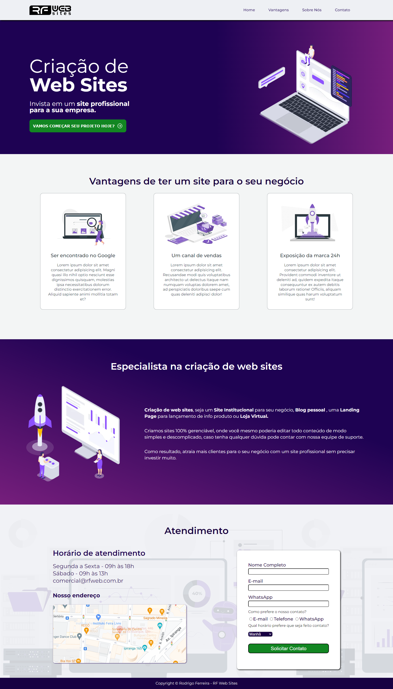

<h1 align="center"> Meu site de estudos </h1>

  Projeto para colocar em prática a aprendizagem baseada em estudos.

## 💻

  

## 🤳

  

 

## 🚀 Tecnologias

Esse projeto foi desenvolvido até o momento com as seguintes tecnologias:

- <strong>
     
      HTML
  </strong>
- <strong>
     
      CSS
  </strong>

## 💻 Projeto

O web site rfweb e um projeto simples para aplicar os conceitos estudados até o momento.

## 🌐 Link 
